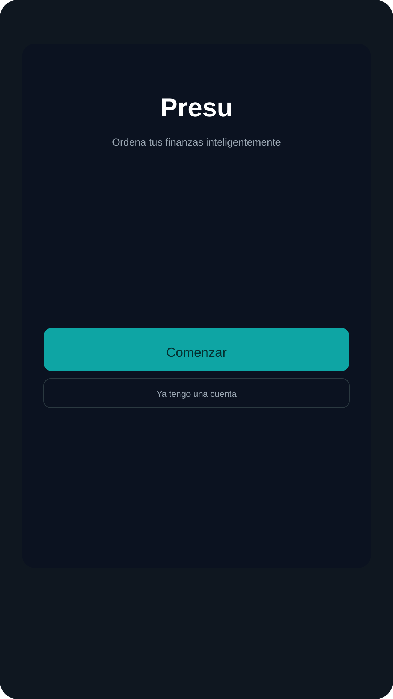
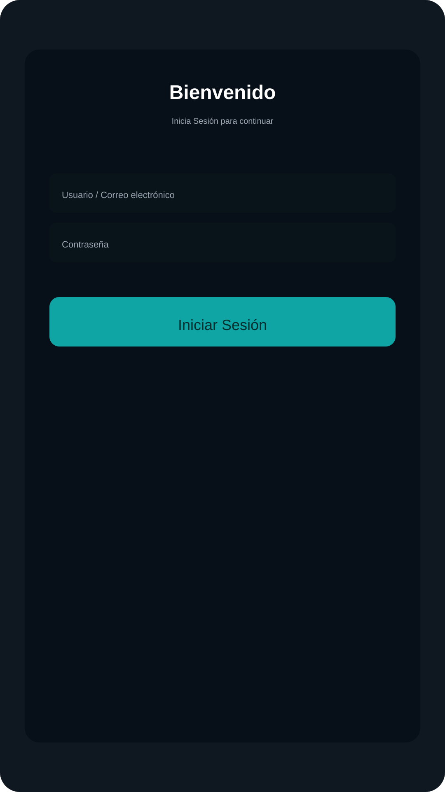
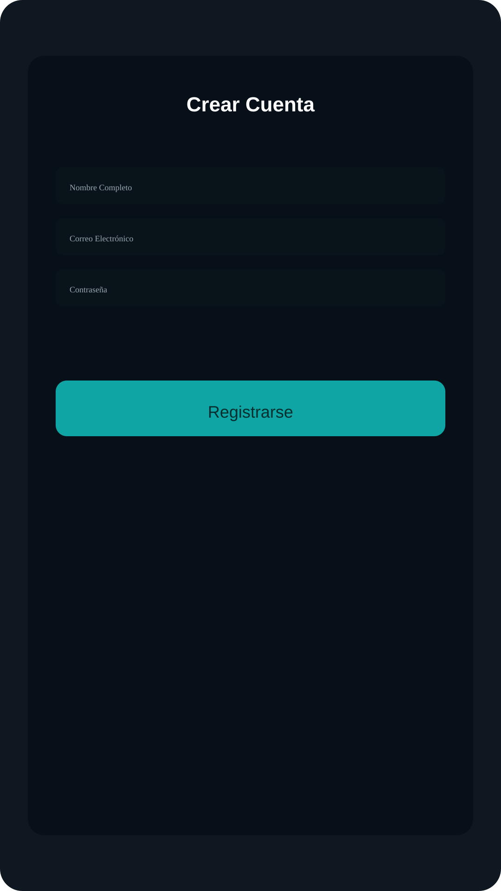
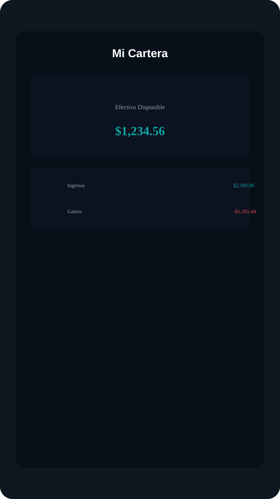

# Presu — Descripción del Proyecto

## Resumen ejecutivo

Presu es una aplicación móvil (Expo / React Native) para gestión personal de finanzas que ayuda a los usuarios a ordenar sus ingresos, gastos y presupuestos. Ofrece autenticación con Supabase, registro y recuperación de contraseña, gestión de transacciones, visualizaciones de flujo y un panel de cartera.

## Propósito y público objetivo

- Propósito: Facilitar la organización y seguimiento del flujo de caja personal y el control de presupuestos mensuales.
- Público objetivo: Usuarios jóvenes-adultos y profesionales que buscan una app simple y visual para administrar sus finanzas personales; pequeñas PYMEs que requieren control básico de caja.

## Funcionalidades principales

- Registro e inicio de sesión con correo y contraseña (Supabase Auth).
- Recuperación de contraseña mediante enlace y tokens (integrado con `expo-linking`).
- CRUD de transacciones: agregar, editar y eliminar transacciones.
- Visualización de la cartera: balance calculado, ingresos vs gastos y flujo mensual.
- Gestión de presupuestos por categoría (tabla `budgets`).
- Navegación por pantallas: Welcome, Login, Register, Wallet, Stats, Profile, Explore, Transacción detalle.
- Soporte multiplataforma (iOS, Android y web) gracias a Expo.

## Arquitectura y diseño técnico

- Framework: Expo + React Native con TypeScript.
- Enrutamiento: `expo-router` (file-based routing usando la carpeta `app/`).
- Backend: Supabase (Auth + Postgres). Las tablas clave son `transactions` y `budgets`.
- Cliente Supabase: `services/supabase.ts` crea un `createClient` y usa `AsyncStorage` para persistir sesión.
- Abstracción de API: `services/api.ts` exporta `CloudAPI` con métodos: `login`, `register`, `getTransactions`, `addTransaction`, `updateTransaction`, `deleteTransaction`, `getBudgets`, `setBudget`, `sendPasswordResetEmail`, `setSessionFromUrl`, `updatePassword`.
- Almacenamiento cliente: `@react-native-async-storage/async-storage` para tokens y sesión (a través de la integración personalizada `ExpoStorage`).

## Modelo de datos (resumen)

- transactions: id, user_id, title, amount, type (income/expense), icon, date, created_at
- budgets: id, user_id, category_id, amount
- users: gestionados por Supabase Auth (user id, email, metadata como `full_name`)

## Stack tecnológico

- Frontend: React 19, React Native 0.81, Expo ~54, TypeScript
- Navegación y UI: `expo-router`, `@react-navigation/*`, componentes propios en `components/ui`
- Backend-as-a-Service: Supabase (`@supabase/supabase-js`)
- Persistencia local: `@react-native-async-storage/async-storage`
- Visualización: `react-native-gifted-charts` (presente en package.json)
- Otras: `expo-font`, `expo-linear-gradient`, `react-native-svg`.

## Variables de entorno necesarias

- `EXPO_PUBLIC_SUPABASE_URL` — URL del proyecto Supabase
- `EXPO_PUBLIC_SUPABASE_ANON_KEY` — Key anónima para cliente

Estas variables se usan en `services/supabase.ts`.

## Cómo ejecutar localmente (demo rápido)

1. Clonar repo.
2. Instalar dependencias: `npm install`.
3. Añadir variables de entorno (ej. usando `.env` o el sistema de Expo).
4. Ejecutar: `npx expo start` y abrir en emulador o Expo Go.

Para una demo en vivo, crear un usuario de prueba y:

- Iniciar sesión.
- Ir a "Mi Cartera" y añadir 2-3 transacciones (ingreso y gasto).
- Mostrar balance, gráficos y pantalla de presupuestos.

## Seguridad y consideraciones

- La aplicación usa la clave pública (anon) de Supabase en el cliente; las reglas de Row Level Security (RLS) deben configurarse en Supabase para proteger datos por `user_id`.
- Las operaciones críticas validan la sesión antes de actuar (ver `CloudAPI.getTransactions` y `addTransaction`).
- La recuperación de contraseña se realiza mediante `resetPasswordForEmail` y `setSessionFromUrl` para manejar tokens desde enlaces.

## Estructura de carpetas clave

- `app/` — Pantallas y rutas (Welcome, Login, Register, (tabs), transaction)
- `components/` — Componentes UI reutilizables (`ui/` contiene `Button`, `Input`, `TransactionItem`)
- `services/` — `supabase.ts`, `api.ts` (lógica de backend)
- `constants/` — Colores y temas
- `assets/images/` — Imágenes y logos

## Puntos de venta y discurso comercial (pitch)

- Problema: Las personas pierden visibilidad de su flujo de caja y presupuestos.
- Solución: Interfaz simple, onboarding rápido y visualizaciones claras que permiten tomar decisiones de gasto.
- Beneficios: Ahorro de tiempo, mayor control financiero, notificaciones y objetivos (futuro).
- Diferenciadores: Interfaz moderna, multiplataforma y backend listo con Supabase para escalar rápido.

Monetización sugerida:

- Plan freemium con límites en número de presupuestos o categorías.
- Suscripción premium para reportes avanzados, exportes CSV/PDF, y sincronización con cuentas bancarias (si se implementa).
- Licenciamiento B2B / white-label para PYMEs.

## Guión recomendado para la presentación (diapositivas)

1. Título y tagline (Presu — Ordena tus finanzas inteligentemente)
2. Problema (dolor del usuario)
3. Solución (qué hace Presu)
4. Demo UI (pantallas clave: Welcome, Login, Wallet, Añadir transacción)
5. Arquitectura y tecnologías (breve)
6. Seguridad y privacidad (RLS, sesiones)
7. Mercado y monetización
8. Roadmap / próximas features
9. Equipo y recursos necesarios
10. Petición/CTA (inversión, pilotos, ventas)

## Recursos y archivos importantes

- Código fuente: carpeta `app/` y `components/`.
- Servicios: `services/supabase.ts`, `services/api.ts`.
- Variables de entorno: `EXPO_PUBLIC_SUPABASE_URL`, `EXPO_PUBLIC_SUPABASE_ANON_KEY`.
- Scripts: `npm start`, `npm run reset-project`.

---

## Capturas de pantalla (simuladas)

Se incluyen capturas SVG que representan las pantallas clave de la aplicación. Puedes abrirlas directamente desde la carpeta `docs/screenshots`.

- Welcome: 
- Login: 
- Register: 
- Wallet: 

